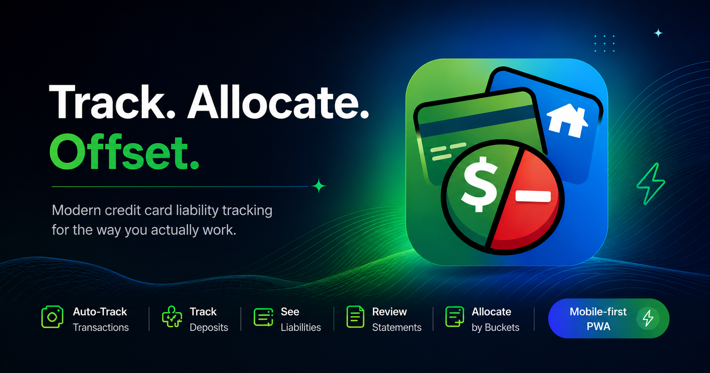

# Offset

<p align="center">
  
</p>

<p align="center">
  The smarter way to manage credit card liabilities.
</p>

<p align="center">
  Track spending • Reconcile payments • Stay ahead of statement cycles
</p>

A modern, mobile-first Progressive Web App for tracking credit card liabilities across billing cycles.

Offset was built to replace spreadsheet-based credit card tracking with a cleaner and faster workflow.

Instead of manually filtering transactions, calculating totals, and maintaining formulas, Offset automatically tracks:

- Credit card transactions
- Deposits already received
- Outstanding liabilities
- Statement history
- Bucket-wise allocation

---

## Why Offset?

Most expense trackers focus on:

- Budgets
- Categories
- Spending analysis
- Investments
- Financial planning

Offset focuses on a much simpler problem:

> When my credit card bill arrives, how much of it is actually mine to pay?

Many transactions are fully yours.

Some belong to family.

Some are shared expenses where you've already collected money from others.

Managing this through spreadsheets works, but quickly becomes repetitive.

Offset automates the calculations while keeping the workflow simple.

---

## The Core Idea

Every transaction consists of:

| Field | Description |
|---------|---------|
| Transaction | Name of the transaction |
| Amount | Total transaction value |
| Deposit | Money already received |
| Bucket | Group the transaction belongs to |
| Date | Transaction date |

The fundamental calculation is:

```text
Outstanding = Amount - Deposit
```

Example:

| Field | Value |
|---------|---------|
| Transaction | Restaurant |
| Amount | ₹2,000 |
| Deposit | ₹1,500 |
| Bucket | Personal |

Result:

```text
Outstanding = ₹500
```

The source of the deposit does not matter.

It could come from:

- Friends
- Family
- Colleagues
- Roommates
- Anyone else

Only the amount matters.

---

## Real World Example

Suppose your statement contains:

| Transaction | Amount | Deposit | Bucket |
|------------|---------:|---------:|---------|
| Electricity | ₹2,590 | ₹0 | Home |
| Dmart | ₹5,582 | ₹0 | Home |
| Restaurant | ₹2,000 | ₹1,500 | Mine |
| Hotel | ₹6,000 | ₹4,500 | Home |
| Shoes | ₹2,165 | ₹0 | Mine |

Outstanding amounts become:

| Transaction | Outstanding |
|------------|------------:|
| Electricity | ₹2,590 |
| Dmart | ₹5,582 |
| Restaurant | ₹500 |
| Hotel | ₹1,500 |
| Shoes | ₹2,165 |

No manual calculations.

No spreadsheets.

No formulas.

---

## Billing Cycle Based Tracking

Offset follows your actual credit card statement cycle instead of calendar months.

Default cycle:

```text
17th → 16th
```

Examples:

- 17 May 2026 → 16 Jun 2026
- 17 Jun 2026 → 16 Jul 2026
- 17 Jul 2026 → 16 Aug 2026

Transactions are automatically assigned to the correct statement period based on transaction date.

### Example

| Transaction Date | Statement |
|---------|---------|
| 25 May 2026 | 17 May → 16 Jun |
| 10 Jun 2026 | 17 May → 16 Jun |
| 20 Jun 2026 | 17 Jun → 16 Jul |

No manual statement management required.

---

## Buckets

Transactions can be grouped into custom buckets.

Examples:

- Home
- Mine
- Business
- Travel
- Family
- Personal

Buckets allow liabilities to be tracked independently while using the same calculation model.

Example:

| Bucket | Outstanding |
|---------|---------:|
| Home | ₹4,340.95 |
| Personal | ₹9,490.00 |
| Business | ₹2,500.00 |

---

## Example Statement

### Current Statement

```text
17 Jun 2026 → 16 Jul 2026
```

### Summary

| Metric | Amount |
|---------|---------:|
| Total Spend | ₹19,589.33 |
| Total Deposits | ₹5,758.38 |
| Total Outstanding | ₹13,830.95 |

### Bucket Breakdown

| Bucket | Total | Deposits | Outstanding |
|---------|---------:|---------:|---------:|
| Home | ₹8,840.95 | ₹4,500.00 | ₹4,340.95 |
| Personal | ₹10,748.38 | ₹1,258.38 | ₹9,490.00 |

---

## Features

### Statement-Based Tracking

Track liabilities according to your actual credit card billing cycle.

### Deposit Tracking

Record money already collected against transactions.

### Automatic Calculations

Offset automatically calculates:

- Total Spend
- Total Deposits
- Total Outstanding
- Bucket Totals
- Bucket Deposits
- Bucket Outstanding

### Statement History

Browse previous statement cycles anytime.

Examples:

- 17 Jun → 16 Jul
- 17 May → 16 Jun
- 17 Apr → 16 May

### Year Filtering

Quickly jump between years:

```text
2026
2025
2024
```

### Google Authentication

Secure sign-in using Google.

### Progressive Web App

Install directly from the browser.

Features include:

- Offline support
- Fast loading
- Mobile-first experience
- Home screen installation
- Native app feel

---

## Screens

### Dashboard

View your current statement at a glance.

Includes:

- Current Statement Period
- Total Spend
- Total Deposits
- Outstanding Amount
- Bucket Summaries
- Recent Transactions

---

### Transactions

Manage all transactions.

Features:

- Create Transaction
- Edit Transaction
- Delete Transaction
- Search
- Filter by Bucket
- Filter by Statement

---

### Statements

Browse historical billing cycles.

Features:

- Year Filter
- Statement Archive
- Statement Details
- Historical Transactions
- Liability Summaries

---

### Profile

Manage application preferences.

Features:

- User Profile
- Billing Cycle Settings
- Bucket Management
- Sign Out

---

## Technology Stack

### Frontend

- Next.js 15
- TypeScript
- Tailwind CSS v4
- Shadcn/UI
- Lucide Icons
- Framer Motion
- React Hook Form
- Zod

### Backend

- Firebase Authentication
- Firestore Database
- Firebase Storage

### PWA

- Service Workers
- Offline Support
- Installable Experience

---

## Philosophy

Offset intentionally avoids becoming a full personal finance platform.

There are no budgets.

There are no spending categories.

There are no investment dashboards.

There are no complicated reports.

Offset focuses on a single job:

> Track credit card transactions, account for deposits already received, and instantly understand what remains outstanding.

Simple. Fast. Focused.